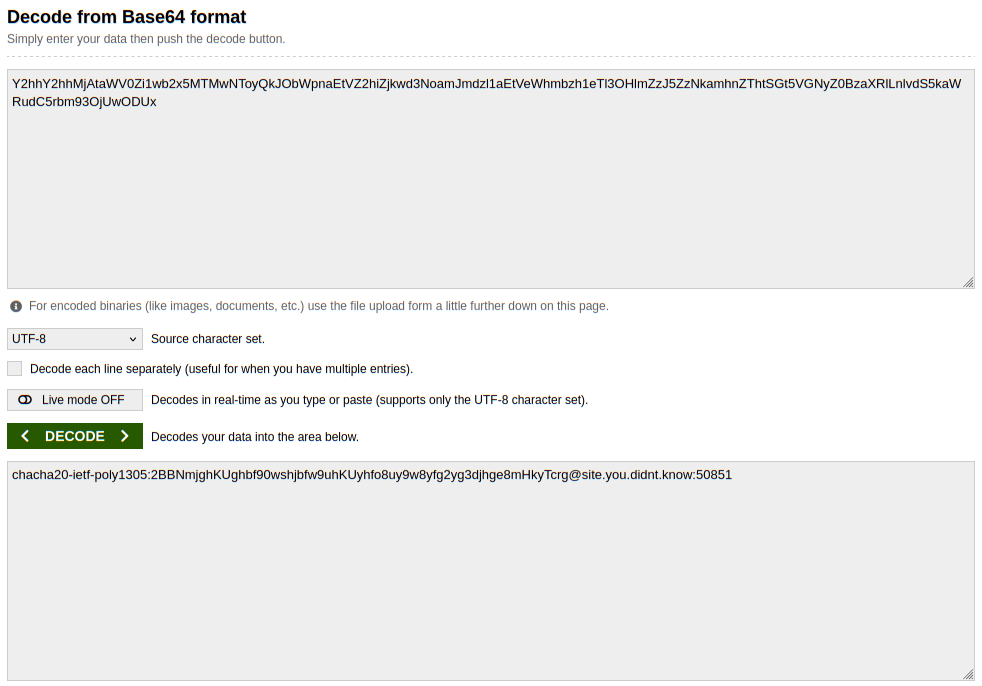

# Подключение Outline VPN на сервере без графического интерфейса. 

## Вступление
Привет, дорогой читатель! Начну немного издалека. Меня зовут Сергей и я ~~:[||наркоман||]:~~ сисадмин, плавно дрейфующий с Windows в сторону Linux. У меня хорошая работа, неплохая зарплата, но всегда хочется чего-то новенького, так вот случилось и у меня. С Linux у меня связано много приятного, но раньше это всегда было на уровне курения манулов, в какой-то момент что-то щёлкнуло у меня в голове и я начал изучать Bash и собственно углубляться в *NIX-подобные системы. Надеюсь, не сильно утомил таким введением, потому что,  в общем-то перехожу к сути. Скриншотов будет мало, воды - много. 

<spoiler title="TL:DR">
Используйте shadowsocks-libev-local с конфигом на основе дефолтного
</spoiler>

## Завязка
Есть у меня несколько тестовых серверов, где я опробую всякое. И вот, понадобилось мне уже пользоваться VPN, но, вот беда, РКН научился резать OpenVPN и Wireguard заграницу. На мобильном телефоне и десктопах пользуюсь одним отличным сервисом VPN на основе Outline. Но что делать с сервером? Гугление и дакдакление внятного ничего не показало, лишь обрывки информации, которые я и собрал в этой статье. Итак:

+ из статьи [Настройка клиента Outline VPN на OpenWRT (все версии) на базе пакета shadowsocks-libev и tun2socks](https://habr.com/ru/articles/748408/) мы узнаём куда копать и чем копать. Outline использует Shadowsocks, поэтому поставим в систему пакет.
+ из статьи [Shadowsocks-туннелирование корпоративного VPN](https://habr.com/ru/companies/ruvds/articles/757848/) мы узнаём как правильно копать. Настроим клиент.
+ из опыта и прочих манулов покажу куда и что прописать чтобы заработало для:
  + только одного пользователя
  + всей системы
+ проверим подключения

## Начнём
Для начала у нас должен быть конфиг для подключения вида `ss://bla-bla-bla`, `ss://bla-bla-bla#name` или `ss://bla-bla-bla@server.serv:port#name`. Поговаривают, что последний вариант тоже существует, я не встречал, поэтому будем работать с первым видом. Его мы должны расшифровать, как говорит автор первой статьи - с помощью [сайта-декодировщика](https://www.base64decode.org/). Вставляю только часть **bla-bla-bla** и вот, что у меня получается:

*данные, конечно же, невалидные*

Ставим пакет shadowsocks и отключаем запуск сервера, он нам не нужен
```bash
sudo ‑i
apt update && apt install shadowsocks‑libev
systemctl stop shadowsocks-libev
systemctl disable shadowsocks-libev
```

Теперь нам с вами необходимо написать конфиг клиента, напишем мы его на основе дефолтного конфига. Сначала сохраним его. потом переименуем и отредактируем в соответствии выданного нам декодером. Кстати, продолжаем работать под рутом.
```bash
cp /etc/shadowsocks-libev/config.json /etc/shadowsocks-libev/config.json.bak
mv /etc/shadowsocks-libev/config.json /etc/shadowsocks-libev/myvpn.json
vim /etc/shadowsocks-libev/myvpn.json
```
В моём случае сервер статичный и сколько я им пользуюсь - не переезжал, поэтому я заранее перевёл доменное имя в IPv4 адрес (так как у меня здесь пример адреса - вставлю IP гугло-dns, 8.8.8.8)
Изменим дефолтный конфиг в соответствии с нужными нам данными, представлю это в виде diff
```diff
{
-    "server":["::1", "127.0.0.1"],
+    "server":"8.8.8.8",
    "mode":"tcp_an_udp",
-    "server_port":8388,
+    "server_port":50851,
+    "local_address":"127.0.0.1",
-    "local_port":1080,
+    "local_port":631,
-    "password":"7vezO2wapZQM",
+    "password":"2BBNmjghKUghbf90wshjbfw9uhKUyhfo8uy9w8yfg2yg3djhge8mHkyTcrg",
-    "timeout":86400,
+    "timeout":300,
    "method":"chacha20-ietf-poly1305"
}
```
В итоге наш конфиг должен выглядеть следующим образом:
```json
{
    "server":"8.8.8.8",
    "mode":"tcp_an_udp",
    "server_port":50851,
    "local_address":"127.0.0.1",
    "local_port":631,
    "password":"2BBNmjghKUghbf90wshjbfw9uhKUyhfo8uy9w8yfg2yg3djhge8mHkyTcrg",
    "timeout":300,
    "method":"chacha20-ietf-poly1305"
}
```
Сохраняем и выходим из vim, я надеюсь, что все знают как это делать, если нет - тренируйтесь, очень крутая штука.

## Подключение
Мы сконфигурировали клиента shadowsocks и теперь его нужно запустить и проверить. Я надеюсь, вы всё ещё в сессии root
```bash
systemctl start shadowsocks-libev-local@myvpn.service
curl https://ifconfig.me
curl --proxy socks5://127.0.0.1:631 https://ifconfig.me
```
Вы должны увидеть сначала свой IP, а потом - IP вашего VPN сервера
Если всё получилось - великолепно, сделаем сервис постоянным (если нужно, если нет - пропустите этот шаг)
```bash
systemctl enable shadowsocks-libev-local@myvpn.service
exit
```
На этом шаге мы выходим из сессии root

Но писать для каждого сервиса, что рвётся в сеть отдельный параметр с прокси - не наш метод, к тому же, такой параметр бывает не у всех.
Пропишем прокси в оружение, и здесь у нас есть выбор: прописать отдельно для пользователя или для всей системы. Тут всё просто, для того, чтобы прописать переменные окружения мы добавляем следующие строки в `~/.bashrc`, а для всей системы в `/etc/environment` (для этого редактор нужно запустить от суперпользователя), только и всего. Обратите внимание, что строки дублируются в верхнем и нижнем регистрах, это сделано для того, чтобы, как поговаривают в сети, всем клиенты был доступен прокси, сам я не проверял, лучше пусть будет лишняя строка, чем что-то не работает.
```bash
export HTTP_PROXY="socks5://127.0.0.1:631"
export http_proxy="socks5://127.0.0.1:631"
export HTTPS_PROXY="socks5://127.0.0.1:631"
export https_proxy="socks5://127.0.0.1:631"
export FTP_PROXY="socks5://127.0.0.1:631"
export ftp_proxy="socks5://127.0.0.1:631"
export NO_PROXY="127.0.0.1,localhost,192.168.25.0/24"
export no_proxy="127.0.0.1,localhost,192.168.25.0/24"
```
В переменную окружения NO_PROXY я прописал как локальный хост и IP, так и IP домашней подсети
Применяем настройки и проверяем работоспособность. 
```bash
source ~/.bashrc
curl --proxy socks5://127.0.0.1:631 https://ifconfig.me
```

## Заключение
Надеюсь, что вам было интересно читать, буду благодарен любым комментариям. Если у вас всё прошло успешно и моя статья помогла - значит мои изыскания не были напрасны!

И, как постскриптум хочу добавить - чтобы сделать быструю команду отключения прокси добавьте alias в свой .bashrc:
```bash
alias unset HTTP_PROXY http_proxy HTTPS_PROXY https_proxy FTP_PROXY ftp_proxy NO_PROXY no_proxy
```

Всего вам хорошего и отличного настроения!
